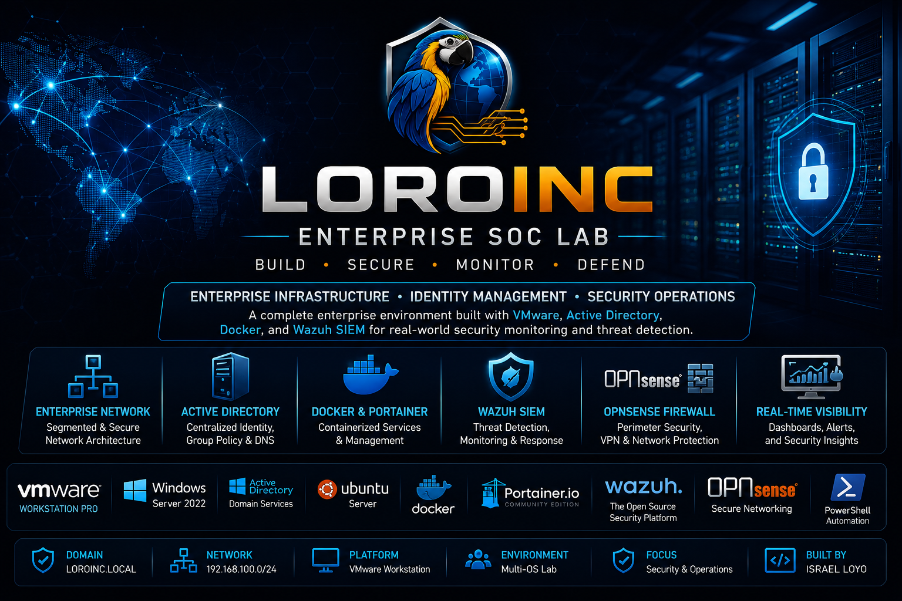
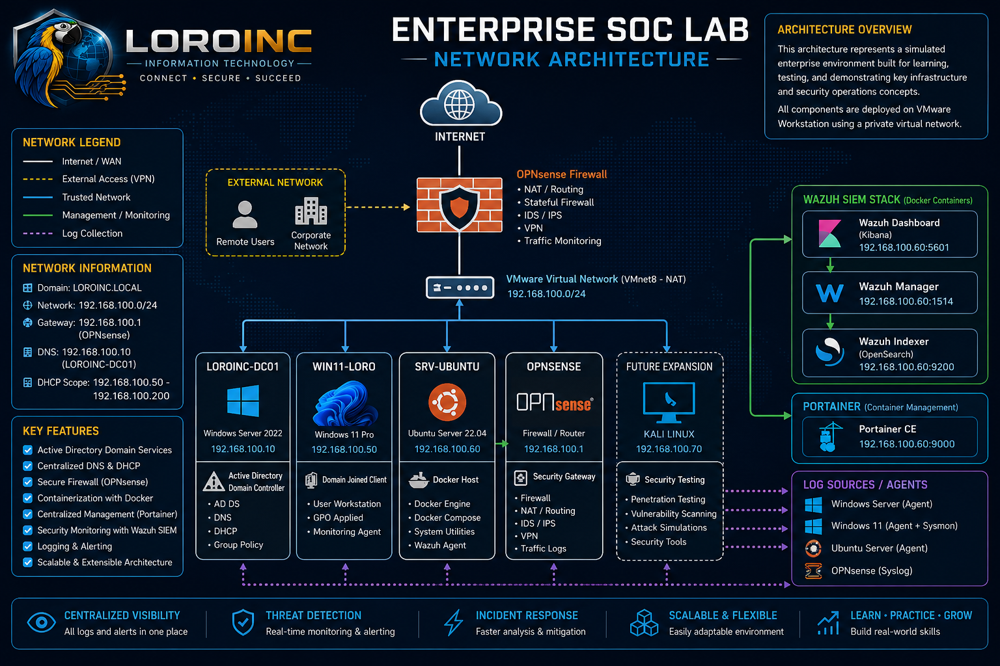
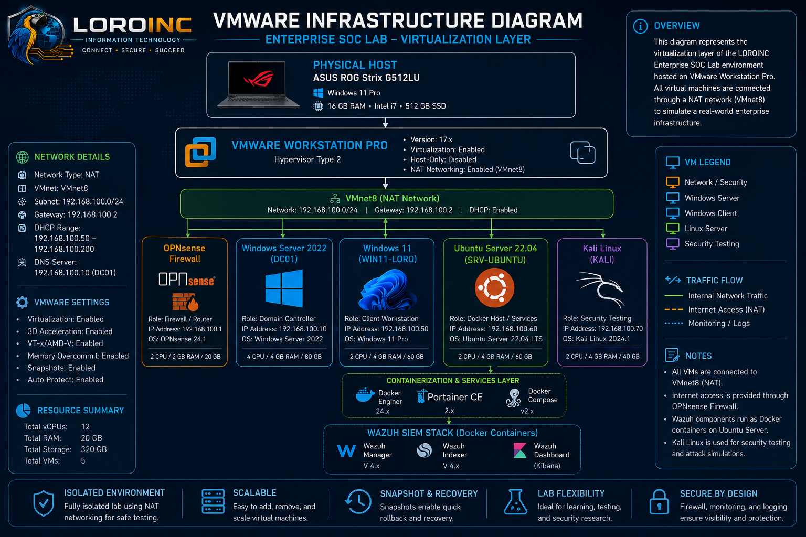
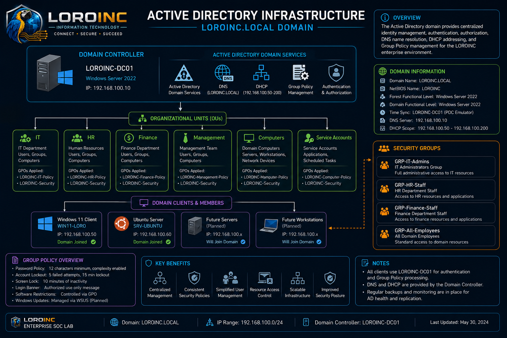
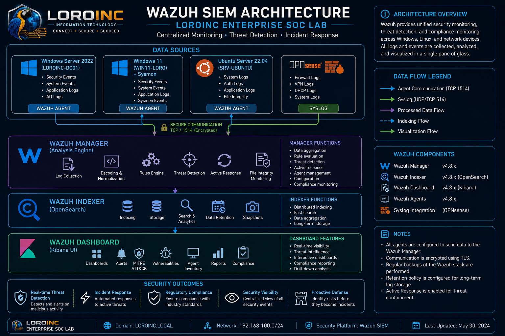

<p align="center">
  
</p>

<p align="center">
  
</p>

# Enterprise SOC Lab

> Enterprise Security Operations Center built from the ground up to simulate a real-world corporate infrastructure.


---

# Project Overview

The Enterprise SOC Lab is a professional home lab designed to replicate the infrastructure of a modern enterprise organization.

The environment combines enterprise networking, Windows Server administration, Linux administration, virtualization, firewall management, centralized logging, endpoint monitoring, and security operations into a single integrated environment.

The objective is to demonstrate practical skills used by Systems Administrators, IT Support Engineers, Infrastructure Engineers, and SOC Analysts.

---

# Enterprise Network Architecture

<p align="center">

</p>

The network consists of:

- OPNsense Firewall
- Windows Server 2022
- Active Directory Domain Services
- DNS
- DHCP
- Ubuntu Server
- Docker
- Portainer
- Wazuh SIEM
- Windows 11 Enterprise Client

---

# VMware Infrastructure

<p align="center">

</p>

Virtual Machines:

| Machine | Role |
|----------|------|
| OPNsense | Firewall / Router |
| Windows Server 2022 | Domain Controller |
| Windows 11 | Enterprise Workstation |
| Ubuntu Server | Docker + Wazuh |
| Management Network | Internal Enterprise Network |

---

# Active Directory Infrastructure

<p align="center">

</p>

Services deployed:

- Active Directory Domain Services
- DNS
- DHCP
- Organizational Units
- Group Policy
- Security Groups
- Enterprise User Accounts
- Shared Resources

---

# Wazuh SIEM Architecture

<p align="center">

</p>

Security Monitoring includes:

- Windows Event Logs
- Linux Logs
- File Integrity Monitoring
- Vulnerability Detection
- Security Alerts
- Agent Monitoring
- Dashboard Analytics

---

# Technology Stack

| Category | Technologies |
|----------|--------------|
| Virtualization | VMware Workstation |
| Firewall | OPNsense |
| Server | Windows Server 2022 |
| Client | Windows 11 Enterprise |
| Linux | Ubuntu Server |
| Identity | Active Directory |
| DNS | Microsoft DNS |
| DHCP | Microsoft DHCP |
| Containers | Docker |
| Container Management | Portainer |
| SIEM | Wazuh |
| Networking | TCP/IP, NAT, VLANs |
| Documentation | Markdown |
| Version Control | Git & GitHub |

---

# Skills Demonstrated

- Enterprise Infrastructure
- Windows Server Administration
- Active Directory
- DNS Administration
- DHCP Administration
- Group Policy Management
- Firewall Administration
- Linux Administration
- Docker Administration
- Portainer Management
- Wazuh SIEM
- Security Monitoring
- Event Analysis
- Network Troubleshooting
- VMware Virtualization
- Enterprise Documentation
- Git Version Control

---

# Screenshots

The following screenshots will be added as the lab progresses.

- VMware Workstation
- OPNsense Dashboard
- Windows Server
- Active Directory
- DNS Manager
- DHCP Manager
- Group Policy
- Ubuntu Server
- Docker Containers
- Portainer
- Wazuh Dashboard
- Security Events
- MITRE ATT&CK
- Vulnerabilities
- File Integrity Monitoring

---

# Documentation

| Document | Description |
|----------|-------------|
| Company Background | Enterprise overview |
| Business Requirements | Project requirements |
| Project Objectives | Goals and scope |
| VMware Deployment | Virtual infrastructure |
| Network Design | Network architecture |
| OPNsense Firewall | Firewall configuration |
| Windows Server | Server deployment |
| Active Directory | Domain configuration |
| DNS & DHCP | Network services |
| Ubuntu Server | Linux server |
| Docker & Portainer | Container platform |
| Wazuh SIEM | Security monitoring |
| Troubleshooting | Common issues |
| Lessons Learned | Project reflections |
| Roadmap | Future improvements |

---

# Roadmap

## Phase 1
- [x] Enterprise branding
- [x] Repository structure
- [x] Architecture diagrams

## Phase 2
- [x] VMware screenshots
- [x] OPNsense screenshots
- [x] Windows Server documentation
- [x] Active Directory documentation
- [x] Wazuh screenshots

## Phase 3
- [x] Incident response scenarios
- [x] Vulnerability management
- [x] Detection engineering
- [x] Security playbooks

---

# Repository Structure

```text
Enterprise-SOC-Lab/
│
├── assets/
├── configs/
├── diagrams/
├── docs/
├── screenshots/
├── scripts/
└── README.md
```

---

# Author

**Israel Loyo**

IT Support Technician | Systems Administration | Cybersecurity

- CompTIA Security+
- Fortinet NSE 3
- Cybersecurity Analyst Diploma
- CCNA (In Progress)

---

# License

This project is intended for educational, portfolio, and professional demonstration purposes.